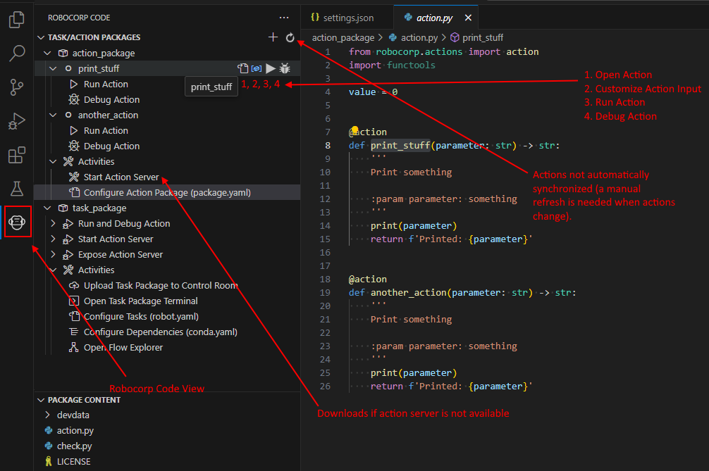

# Template: Python - Actions

This template gets you started in creating Actions for [Robocorp Action Server](https://github.com/robocorp/robo/tree/master/action_server/docs#readme).

`Actions` and `Action Server` enable you to "give your AI Agents hands" meaning that your AI/LLM Agent can help your users perform distinct actions that get executed based on the LLM discussion.

## Quickstart

<details open>
<summary><b>For macOS</b></summary>

```sh
# Install Robocorp Action Server
brew update
brew install robocorp/tools/action-server 

# Bootstrap a new project using this template.
# You'll be prompted for the name of the project (directory):
action-server new

# Start Action Server 
cd my-project
action-server start --expose
```
</details>
<br/>
<details>
<summary><b>For Windows</b></summary>

```sh
# Download Robocorp Action Server
curl -o action-server.exe https://downloads.robocorp.com/action-server/releases/latest/windows64/action-server.exe

# Add to PATH or move to a folder that is in PATH
setx PATH=%PATH%;%CD%

# Bootstrap a new project using this template.
# You'll be prompted for the name of the project (directory):
action-server new

# Start Action Server 
cd my-project
action-server start --expose
```

</details>
<br/>

<details>
<summary><b>For Linux</b></summary>

```sh
# Download Robocorp Action Server
curl -o action-server https://downloads.robocorp.com/action-server/releases/latest/linux64/action-server
chmod a+x action-server

# Add to PATH or move to a folder that is in PATH
sudo mv action-server /usr/local/bin/

# Bootstrap a new project using this template.
# You'll be prompted for the name of the project (directory):
action-server new

# Start Action Server 
cd my-project
action-server start --expose
```

</details>
<br/>

🚀 You should now have an Action Server running locally at: [http://localhost:8080](http://localhost:8080)) and a public internet-facing URL (something like "https://twently-cuddly-dinosaurs.robocorp.link").

🚀 `Robocorp Action Server` is in developer preview, so expect many updates soon to the tooling, templates, examples and documentation.

## Dependency management

Action Server uses [conda.yaml](conda.yaml) file serving as the configuration file for managing the environment in which your actions run. It specifies the dependencies and packages required, ensuring that each run happens in a clean and repeatable environment.

🙋‍♂️ "Why not just `pip install...`?"<br/>
👉 You'll probably not run the Actions just on your machine forever
<details>
<summary>Want to know more...</summary>

* You do not need to manage Python installations on the target machines
* You can avoid `Works on my machine`
* You can control exactly which version of Python your automation will run on 
  * ..as well as the pip version to avoid dep. resolution changes
* No need for venv, pyenv, ... tooling and knowledge sharing inside your team.
* Define dependencies in conda.yaml let our tooling do the heavy lifting.
* You get all the content of [conda-forge](https://prefix.dev/channels/conda-forge) without any extra tooling

</details><br/>

To add a new dependency, simply add them to the pip section of the [conda.yaml](conda.yaml) dependencies:

```yaml
channels:
  - conda-forge

dependencies:
  - python=3.10.12
  - pip=23.2.1
  - robocorp-truststore=0.8.0
  - pip:
      - robocorp==1.4.0
      - robocorp-actions==0.0.4
      - pytz==2023.3
```
👉 You also have all the tools and packages from [conda-forge](https://prefix.dev/channels/conda-forge) available in the `dependencies` -section.. not just Python.

## Actions in VS Code 

👉 Using [Robocorp Code extension for VS Code](https://marketplace.visualstudio.com/items?itemName=robocorp.robocorp-code), you can get everything set up and running in VS Code in no time.

The template has a few files that enable the extension to find and set up your action environment and provide code completion. There is also a side panel where we have and will add some easy-to-use functionalities.



When debugging your Actions Python code, you probably do not want to give the inputs every time you run and always be running the Action Server, so you can set your test inputs in a [input.json](./devdata/input.json) and just run/debug your Python code.


## What does the template Action do?

The template is a simple starting point to show how to get started.

The action enables you to get the timezone differences between locations.

We use [pytz](https://pypi.org/project/pytz/) as an example to show that you can leverage the whole Python ecosystem. Robocorp provides a [bunch of libraries](https://pypi.org/search/?q=robocorp-); you can make your own. The sky is the limit.

🚀 Now, go get'em

